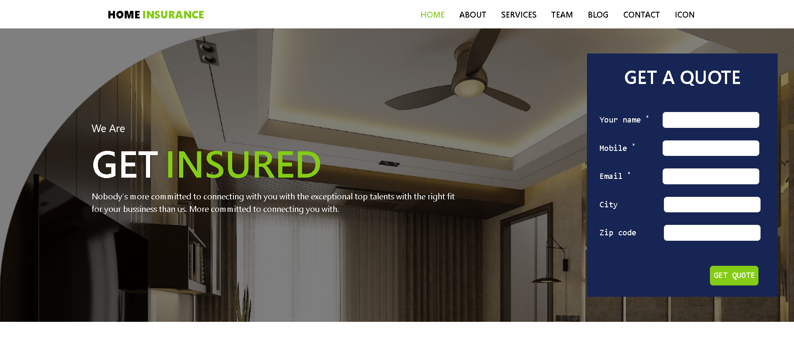

# Home Insurance - Landing Page Clone


A static and responsive clone of a modern home insurance company's landing page. This project was built to practice and demonstrate skills in front-end web development using pure HTML and Tailwind CSS.



---

## 📋 Table of Contents

1.  [Description](#-description)
2.  [Features](#-features)
3.  [Technologies Used](#-technologies-used)
4.  [Getting Started](#-getting-started)
5.  [How to Use](#-how-to-use)

---

## 📜 Description

This project is a visual clone of a professional insurance website's landing page. The primary goal was to replicate the design, layout, and responsiveness of a modern website using only HTML and the Tailwind CSS utility-first framework (via CDN). The page is static and serves as a portfolio piece to showcase front-end design and layout skills.

The page is structured into several logical sections, including a hero banner with a "Get a Quote" form, an about us section, client testimonials, a team showcase, and a detailed footer.

---

## ✨ Features

-   **Responsive Navigation:** A clean header with navigation links that smoothly scroll to different sections of the page.
-   **Hero Section:** An eye-catching banner with a background image, overlay, and a prominent call-to-action form.
-   **Multi-Section Layout:** The page includes dedicated sections for:
    -   About Us
    -   Happy Clients / Testimonials
    -   Our Team
    -   Our Works / Portfolio
    -   Newsletter Subscription
    -   Contact Information
-   **Utility-First Styling:** The entire layout is built using Tailwind CSS classes directly in the HTML, demonstrating a modern approach to styling without writing custom CSS files.

---

## 🚀 Technologies Used

-   **HTML5:** For the core structure and content of the webpage.
-   **Tailwind CSS (v3 via CDN):** For all styling, layout, and responsiveness without any custom CSS.

---

## 🏁 Getting Started

Because this project uses the Tailwind CSS CDN, there is **no complex build setup or installation required**. You just need a web browser and the project files.

### Installation

1.  **Clone the repository**

    ```bash
    git clone [https://github.com/your-username/your-repo-name.git](https://github.com/your-username/your-repo-name.git)
    ```

2.  **Navigate to the project directory**

    ```bash
    cd your-repo-name
    ```

3.  **Open the `index.html` file** in your favorite web browser.
    -   You can simply double-click the file.
    -   **Recommended:** For a better experience, use a simple live server. If you are using Visual Studio Code, you can install the "Live Server" extension, right-click the `index.html` file, and choose "Open with Live Server".

---

## 🔧 How to Use

Simply open the `index.html` file in a browser to view the landing page. All local images are expected to be in an `assets` folder in the same directory as the `index.html` file. You can scroll through the different sections or use the navigation links at the top to jump to a specific part of the page.
